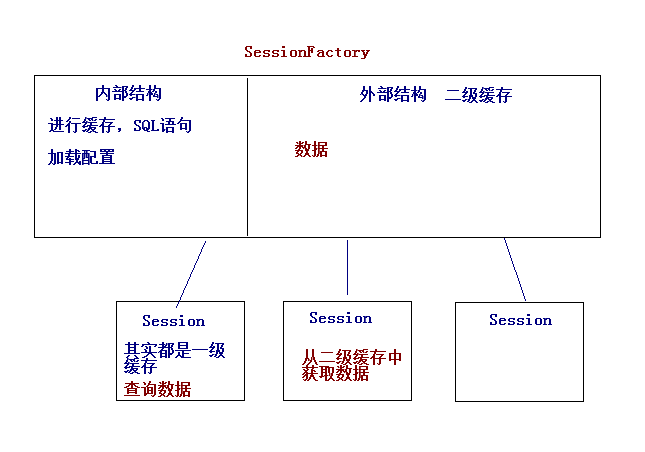

## Configuration

类作用：

- Configuration对象用于配置并且启动Hibernate。
- Hibernate应用通过该对象来获得对象-关系映射文件中的元数据，以及动态配置Hibernate的属性，然后创建SessionFactory对象。
- 简单一句话：加载Hibernate的配置文件，可以获取SessionFactory对象。

其他作用：

- 加载配置文件的种类，Hibernate支持xml和properties类型的配置文件，在开发中基本都使用XML配置文件的方式。

- 如果采用的是properties的配置文件，那么通过Configuration configuration = new Configuration();就可以装载配置文件 但是需要自己手动加载映射文件

  例如：`config.addResource("me/feathers/domain/Student.hbm.xml");`

- 如果采用的XML的配置文件，通过`Configuration configuration = new Configuration().configure();`加载配置文件

## SessionFactory

**负责初始化Hibernate**。用来充当数据存储源代理，并**负责创建Session对象**（工厂模式）。一个项目只需要SessionFactory即可，因为SessionFactory并不是轻量级的，当需要操作多个不同的数据库时，可以为每个数据库初始化一个SessionFactory。

- 由Configuration通过加载配置文件来创建该对象
- SessionFactory对象中保存了当前数据库的配置信息和所有映射关系以及预定义的SQL语句，这样在进行查询时，直接使用这些语句，无需进行生成sql，可以增加查询效率
- SessionFactory中还负责维护一个Hibernate二级缓存
- 一个SessionFactory对应一个数据库
- 重量级，线程安全，可以被多个线程共享



SessionFactory 的结构分为两个部分：内部结构和外部结构。内部结构进行SQL预加载，配置加载等操作，外部结构为二级缓存（Session以及缓存声明周期较短，为了延长session中的数据的生命周期，可以将数据放入SessionFactory二级缓存中）

## Session

Session对象负责执行被持久化对象的CRUD操作。Session 是应用程序与数据库之间交互操作的一个单线程对象，是 Hibernate 运作的中心

- 所有持久化对象必须在 session 的管理下才可以进行持久化操作
- Session 对象有一个一级缓存（Session内部维护了一个集合，用来保存数据），显式执行 flush 之前，所有的持久化操作的数据都缓存在 session 对象
- 持久化类与 Session 关联起来后就具有了持久化的能力
- 轻量级，线程不安全，所以不要使用成员变量

常见方法：

```java
save(obj)
delete(obj)  
update(obj)
get(Class,id) // 底层使用反射根据主键获取数据
saveOrUpdate(obj) //保存或者修改（如果没有数据，保存数据。如果有，修改数据）
createQuery() 	//HQL查询的方式
createSQLQuery() // SQL查询方式
createCriteria() // QBC查询方式
```

错误（重要）：

- 如果在配置文件中定义主键的生成策略为自动生成，而不是手动控制，那么在调用save()或者saveOrUpdate()方法之前，给对象设置id，是无法保存到数据库中的（会出现异常），因为id主键是不能被设置的。所以在修改数据时，需要先从数据库中取出对象，再修改持久化对象，再调用update()

## Transaction

Hibernate事务，保证任务同时成功，同时失败。如果没有开启事务，则每个Session都是一个单独的事务。

- tr.commit() 提交事务，将持久化对象做出的操作应用到数据库中
- tr.rollback() 事务回滚

当事务中的某个操作，发生了错误，可以使用transaction对象进行事务的回滚操作

