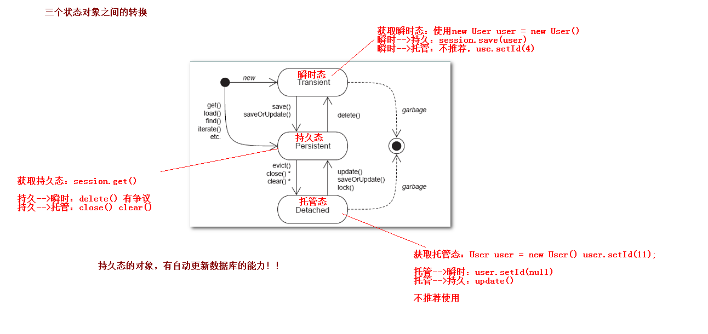

# Hibernate 持久化对象的三个状态

## 持久化类

就是一个Java类（JavaBean），这个Java类与表建立了映射关系就可以成为是持久化类。

	持久化类 = JavaBean + xxx.hbm.xml/注解

## 三个状态

Hibernate为了管理持久化类，将持久化类分为三个状态：

>  (OID 就是JavaBean的id属性，没有持久化OID就是没有id值，id值是数据库生成的)
>
>  Session是一个缓存，如果对象在session缓存中，则说明对象被纳入到Session对象的管理中了
>

- 瞬时态:Transient  Object    没有持久化标识OID, 没有被纳入到Session对象的管理.    还没和session发生关系
- 持久态:Persistent Object    有持久化标识OID,已经被纳入到Session对象的管理.     正在和session发生关系
- 脱管态:Detached Object     有持久化标识OID,没有被纳入到Session对象的管理.     和session发生关系之后


### 瞬时态

```java
// User类是一个持久化类
// 直接创建一个User对象
User user = new User();
user.setName("jack");
user.setAge(50);
// 和session没有任何关系，所以处于瞬时态
```

### 持久态

```java
// 使用session保存user
Serializable id = session.save(user); 
syso(id);
// 使用session的save方法
// 因为session此时已经和数据库链接，session将会采用数据库递增的机制，给user对象生成OID对象id
// 并且将user对象添加到session缓存中
```

### 托管态（脱离session管理）

```java
tr.close();
// 事务提交
session.close();
// session被销毁，销毁之后，缓存中的对象都没了
user.getId(); // 此时代码中的user对象进入托管态，session已经不对user对象进行管理 
```

# 三个状态之间的转换

